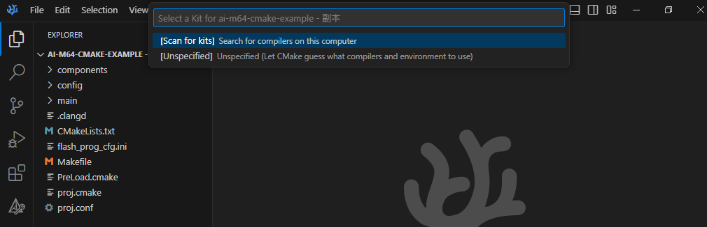
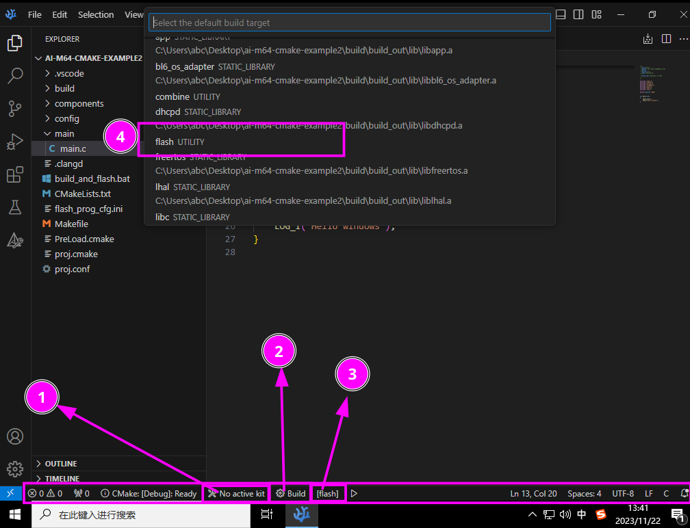

## Example cmake project for AI-M6X-SDK

## 中文

### 如何使用

首先需要准备好SDK：[AI-M6X-SDK](https://gitee.com/Ai-Thinker-Open/aithinker_Ai-M6X_SDK)

当你准备好SDK后，你可以选择将SDK路径加入至你的系统环境变量中或者直接对项目所检测SDK的默认路径进行配置，
对于添加系统环境变量，则需要直接新建一个名为`AI_M6X_SDK`的环境变量，并将SDK根目录路径作为此环境变量的
值，例如 `AI_M6X_SDK='/path/to/your/sdk'`；而对于不想设置环境变量的用户，可以在`proj.conf`文件中
手动配置SDK路径。

如果未设置环境变量`AI_M6X_SDK`，并且默认位置不存在 SDK, 则会自动拉取 SDK 至你所设定的默认路径；相似
的，如果工具链不存在，则会自动拉取对应工具链至 SDK 路径

你完全可以直接将此示例复制一份，更改文件名后直接使用。

#### 项目配置

在这个示例的`proj.conf`中，你可以手动指定SDK路径，烧录所使用的串口以及波特率等等参数。

#### 烧录

当你已经使用cmake配置好了这个示例项目后（如命令行方式使用`cmake -S . -B build`配置），
你可以构建`flash`目标（如使用`ninja -j 2 -C build flash`），此目标能够提供从编译到
烧录到`proj.conf`文件中所指定的串口一条龙服务。

### 手动配置项目

如果你想使用终端或者powershell去配置此项目，你可以参考下面步骤。

#### Linux

**确保你的系统已经安装好了 `ninja`, `git` and `cmake`.**

在示例项目所在文件夹中打开终端，输入以下指令即可完成配置:
```
cmake -S . -B build
```

#### Windows

**确保你的系统已经安装好了 `git` and `cmake`. 并且可以通过 powershell 或者 cmd 指令方式访问到`cmake`和`git`指令！**

在示例项目所在文件夹中打开Powershell或cmd，输入以下指令即可完成配置:
```
cmake -S . -B build
```

### 使用VSCode、Clion或其他编辑工具进行配置

#### VSCode

你必须在你的VSCode中先安装好`CMake Tools`拓展，并在VSCode中打开此示例项目，在弹出的选择套件窗口中
选择`由CMake自己指定`选项，然后待配置完成后你可以将构建目标设置为`flash`，之后你可以直接点击构建按钮，
此时会自动编译并烧录至你所指定的串口中。





1. 选择套件
2. 构建所选目标
3. 选择构建目标
4. 选择 `flash` 作为构建目标


## English

### How to use

The first step is prepare the SDK: [AI-M6X-SDK](https://gitee.com/Ai-Thinker-Open/aithinker_Ai-M6X_SDK)

After you cloned the SDK, then add the location of the SDK to your environment `AI_M6X_SDK`, for example `AI_M6X_SDK='/path/to/your/sdk'`

If you have not set `AI_M6X_SDK` variable in your system environment, cmake will clone SDK to your project folder. The default location can be changed in `proj.conf`.

#### Project Configure

You can find some options in `proj.conf`.

#### Compile, Combine and Flash

After you used command like `cmake -S . -B build` to configured project, then you can use `ninja -j 2 -C build flash` to compile your project and flash.

### Manual configuration

If you just want use terminal or powershell to configure project, you can follow these steps.

#### Linux

**Make sure you had installed `ninja`, `git` and `cmake` in your computer.**

Open terminal in this example folder, and follow these commands to configure your project:
```
cmake -S . -B build
```

#### Windows

**Make sure you had installed `git` and `cmake` in your computer. And make sure you can access `git` and `cmake` commands in your powershell or cmd**

Open powershell or cmd in this example folder, and follow these commands to configure your project:
```
cmake -S . -B build
```

### Use VSCode, Clion or other edits or IDEs

#### VSCode

You should install `CMake Tools` extention to your vscode at first. And go to Setting to search option `cmake.options`, set `Status Bar Visibility` to `visible`. After that you can open this example in your vscode, select the kit to `Unspecified`. Then you should change cmake target to `flash` at bottom bar.


1. Select kit
2. Build target
3. select target
4. select target to `flash`
